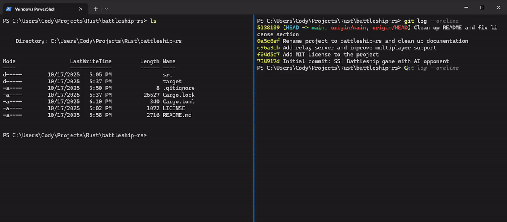

# battleship-rs

Terminal-based networked Battleship game written in Rust.



## Features

- Two-player networked gameplay over TCP
- Single-player mode against AI opponent
- Relay server mode for remote play
- **Power-up card system** - draw cards by hitting ships, use strategic abilities
- **Last Stand mechanic** - morse code challenge for one final comeback chance
- Play again functionality with timeout handling
- Terminal UI using ratatui

## Requirements

- Rust 1.70+
- Terminal with Unicode support

## Installation

```bash
git clone https://github.com/Cod-e-Codes/battleship-rs
cd battleship-rs
cargo build --release
```

## Usage

### Two-Player Game (Local Network)

Start server:
```bash
cargo run --release -- server 8080
```

Connect players (in separate terminals):
```bash
cargo run --release -- client 127.0.0.1:8080
```

### AI Opponent

Start AI server:
```bash
cargo run --release -- server-ai 8080
```

Connect:
```bash
cargo run --release -- client 127.0.0.1:8080
```

### Remote Play via Relay Server

The relay server forwards messages between two players.

On server machine (or cloud instance):
```bash
cargo run --release -- server-relay 8080
```

Players connect from anywhere:
```bash
# Player 1
cargo run --release -- client your-server-ip:8080

# Player 2
cargo run --release -- client your-server-ip:8080
```

## Controls

- Arrow keys: Move cursor
- R: Rotate ship during placement
- Enter: Place ship / Fire at position
- S: Toggle side panel (statistics / power-up cards)
- 1-5: Use power-up cards during your turn
- . / -: Morse code input during Last Stand
- Y/N: Play again (when prompted)
- Q: Quit

## Power-up Cards

Hit enemy ships to draw cards! Use them strategically during your turn:

- **🛡️ Shield**: 50% damage reduction for 1 turn
- **📡 Radar**: Reveal 2 random enemy ship positions
- **🔧 Repair**: Restore 1 HP to a damaged ship
- **🚀 Missile Strike**: Hit 2 random enemy positions

Press S to view your hand, 1-5 to use cards.

## Last Stand

When your last ship is destroyed, you get one final chance! Complete the morse code sequence to restore a random ship and continue the battle.

## Game Rules

- Standard Battleship rules
- 10x10 grid
- 5 ships: Carrier (5), Battleship (4), Cruiser (3), Submarine (3), Destroyer (2)
- Ships cannot overlap
- Players alternate turns after placement phase
- First to sink all opponent ships wins

## Architecture

```
src/
├── main.rs         - Entry point and CLI
├── types.rs        - Core types and messages
├── game_state.rs   - Game logic
├── ui.rs           - Terminal rendering
├── input.rs        - Keyboard handling
├── client.rs       - Client implementation
├── server.rs       - Two-player server
├── server_ai.rs    - AI opponent server
└── server_relay.rs - Relay server for remote play
```

## Server Modes

- `server`: Two-player game, both players connect to same server
- `server-ai`: Single-player against AI
- `server-relay`: Message relay between two players

## Network Protocol

JSON messages over TCP, newline-delimited. Message types:
- `PlaceShips`: Send board configuration
- `Attack`: Fire at coordinates
- `AttackResult`: Hit/miss/sunk feedback
- `YourTurn` / `OpponentTurn`: Turn management
- `CardDrawn` / `CardUsed` / `CardEffect`: Power-up system
- `LastStandTrigger` / `LastStandResult`: Last Stand mechanic
- `GameOver`: End game state
- `PlayAgainRequest` / `PlayAgainResponse`: Play again functionality
- `NewGameStart`: Reset for new game

The relay server forwards all messages between players.

## License

This project is licensed under the MIT License - see the [LICENSE](LICENSE) file for details.